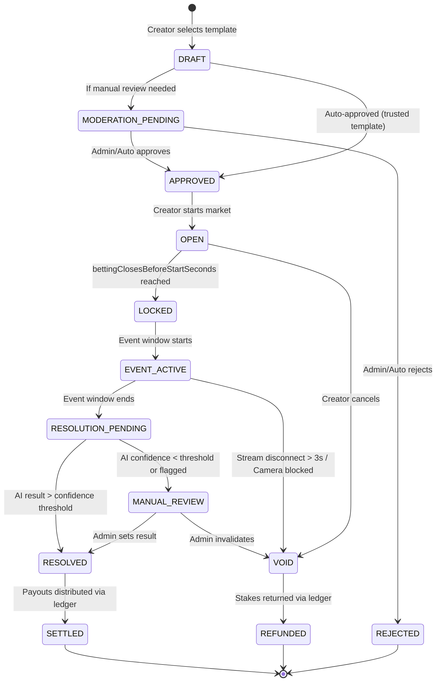

# E. Market State Machine

```mermaid
stateDiagram-v2
    [*] --> DRAFT : Creator selects template
    
    DRAFT --> MODERATION_PENDING : If manual review needed
    MODERATION_PENDING --> APPROVED : Admin/Auto approves
    MODERATION_PENDING --> REJECTED : Admin/Auto rejects
    
    DRAFT --> APPROVED : Auto-approved (trusted template)
    
    APPROVED --> OPEN : Creator starts market
    
    OPEN --> LOCKED : bettingClosesBeforeStartSeconds reached
    
    LOCKED --> EVENT_ACTIVE : Event window starts
    
    EVENT_ACTIVE --> RESOLUTION_PENDING : Event window ends
    
    RESOLUTION_PENDING --> RESOLVED : AI result > confidence threshold
    RESOLUTION_PENDING --> MANUAL_REVIEW : AI confidence < threshold or flagged
    
    MANUAL_REVIEW --> RESOLVED : Admin sets result
    MANUAL_REVIEW --> VOID : Admin invalidates
    
    RESOLVED --> SETTLED : Payouts distributed via ledger
    VOID --> REFUNDED : Stakes returned via ledger
    
    SETTLED --> [*]
    REFUNDED --> [*]
    REJECTED --> [*]
    
    %% Interruptions
    EVENT_ACTIVE --> VOID : Stream disconnect > 3s / Camera blocked
    OPEN --> VOID : Creator cancels
```